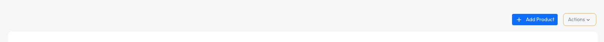
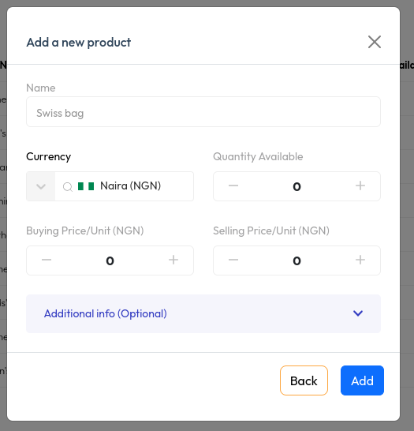
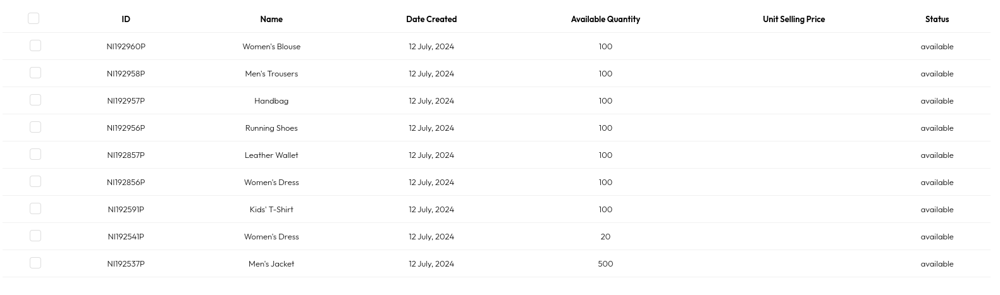

# Create Product

To create a product you need to have the following

- an account
- the account must have a bussiness

Creating a new Product

- on yr dashboard, go to the product page by clicking on product from the sidebar
  .

- on the product page click on the `add product` button
  

  this will pop up a modal where you add all the details of your product

  

- after filling in the details click on the `add` button this will add the product to your collection
  

## Congratulations you have successfully added your product
