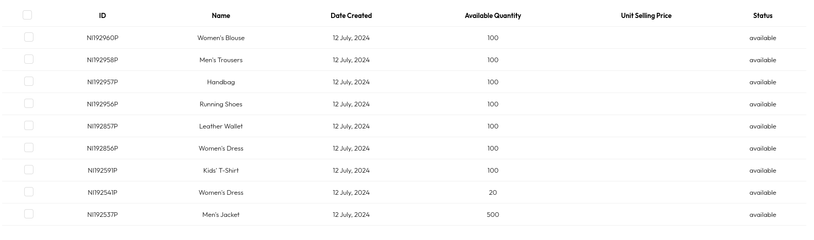

# Editing a product

after creating a new product some of the key details are usally missing and this calls for the need to edit the product.

- on your product dashboard click on any of the product you wish to edit
  

  this will take you to the product details page
  

- from this point on you can now choose to edit the product based on your specific details

  - to edit the product description you click on the pencil icon which will open up a modal and then u can add the description

  - to add the product to a category follow the following steps

    - click on category on the sidebar this will taker you to the category dashboard

      

    - click on the `add new category` button this will open a modal where you can add a new category

    - after sucefully add the category go bacl to your product page and follow steps 1 - 2

    - but this time click on the `Actions` button at the top right

      

      then click on `attach product to category`

    - this will open a modal of all the available categories
      

    - select the category you wish to add the product to add the product to

  - Adding image to a product

    - follow steps - 1 and 2 then click on the add image for products[create_keys_step2](../../static/Screenshot_2024-07-13_08-48-17.png)

## Congratulations you have successfully added your product
